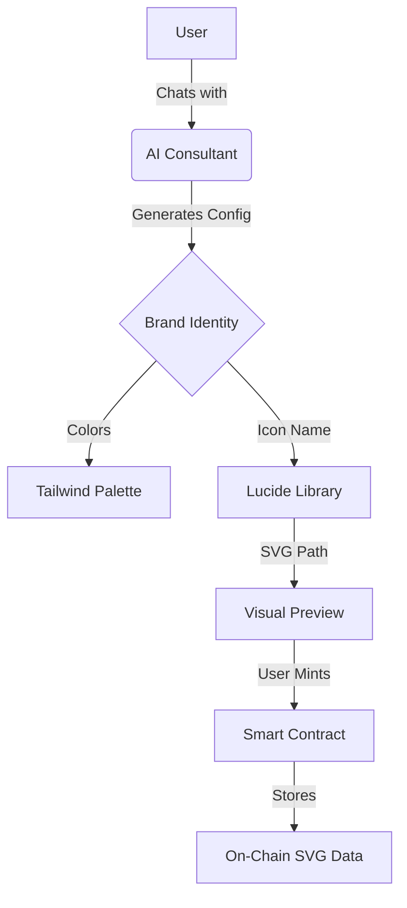

# BrandGenesis AI

<div align="center">
    
    
    
    
    
    
</div>

<p align="center">
    <i>An AI-powered Web3 branding tool. Chat with an expert AI consultant to generate your brand identity and mint it as an NFT—completely gasless.</i>
</p>

---

## Project Overview

**BrandGenesis AI** is a comprehensive **Web3 Brand Consultant** that goes beyond simple random generation. It combines the reasoning capabilities of **Google Gemini 2.0 Flash** with a robust **On-Demand Icon System** to create meaningful, tailored brand identities.

Users can describe their project's vision, audience, and vibe, and the AI will design a logo (icon, shape, color palette) that can be minted as an **On-Chain SVG NFT** on the Sepolia testnet.

### Core Features

| Feature                  | Description                                                                                |
| ------------------------ | ------------------------------------------------------------------------------------------ |
| **AI Design Consultant** | **Gemini 2.0 Flash** powered chat interface that acts as a Senior Designer.                |
| **On-Demand Icons**      | Access to **1,500+ Lucide icons**, generated dynamically based on AI context.              |
| **Instant Preview**      | Real-time SVG rendering of your brand in various contexts (Browser, Mobile app).           |
| **Gasless Minting**      | Mint your Brand NFT for **free**, sponsored by **ZeroDev** (ERC-4337 Account Abstraction). |
| **On-Chain Storage**     | The SVG path data is stored **directly on the smart contract**, ensuring permanence.       |
| **Export Ready**         | Download your logo as a high-quality SVG/PNG instantly.                                    |

---

## How It Works



### The 3-Step Workflow

1.  **AI Design**: Chat with the consultant. Tell it about your "DeFi Yield Aggregator" or "Cyberpunk Game". It will reason about color psychology and symbolism to suggest a design.
2.  **Preview**: See your logo come to life instantly. The system pulls the correct SVG path from a library of 1500+ icons. You can refine the design by talking to the AI.
3.  **Mint**: Once satisfied, one click mints the branding as an NFT. You own the **path data** forever on Sepolia.

---

## Smart Contract Architecture

The project uses a custom ERC-721 contract (`BrandGenesis.sol`) optimized for on-chain design storage.

- **Dynamic SVG Generation**: The `tokenURI` function constructs the SVG string on-the-fly using the stored parameters (Path Data, ViewBox, Fill Color).
- **Serverless**: No IPFS or external API is required to render the image once minted. It lives on Ethereum.

---

## Technology Stack

### Frontend & Logic

- **[Next.js 15](https://nextjs.org/)** - App Router & Server Actions
- **[React 19](https://react.dev/)** - UI Library
- **[Tailwind CSS](https://tailwindcss.com/)** - Retro/Cyberpunk Styling
- **[Lucide React](https://lucide.dev/)** - Icon System

### Web3 & Auth

- **[Privy](https://privy.io/)** - Embedded Wallets & Auth (Email, Google, Wallet)
- **[ZeroDev](https://zerodev.app/)** - Account Abstraction (Gasless Paymaster)
- **[viem](https://viem.sh/)** - Type-safe Ethereum interactions

### AI

- **[Google Gemini API](https://ai.google.dev/)** - `gemini-2.0-flash-exp` for high-speed design reasoning.

---

## Project Setup

### Prerequisites

- Node.js 18+
- Privy App ID ([Get here](https://dashboard.privy.io/))
- ZeroDev Project ID ([Get here](https://dashboard.zerodev.app/))
- Google AI API Key ([Get here](https://aistudio.google.com/))

### Environment Configuration

Create a `.env.local` file:

```env
# Privy - Authentication
NEXT_PUBLIC_PRIVY_APP_ID=your_privy_app_id
# (Optional) Server-side secret
PRIVY_APP_SECRET=your_privy_secret

# ZeroDev - Account Abstraction
NEXT_PUBLIC_ZERODEV_PROJECT_ID=your_zerodev_project_id

# Google AI - Consultant
GOOGLE_API_KEY=your_google_api_key

# Blockchain
SEPOLIA_RPC_URL=https://rpc.sepolia.org
```

### Installation

```bash
# Clone the repository
git clone https://github.com/CallejaJ/brand-genesis-ai.git
cd brand-genesis-ai

# Install dependencies
npm install

# Start development server
npm run dev
```

---

## License

MIT License - Built for the Web3 design community.

---

<div align="center">
    <p><b>BrandGenesis AI</b></p>
    <p>Design - Mint - Own</p>
</div>
